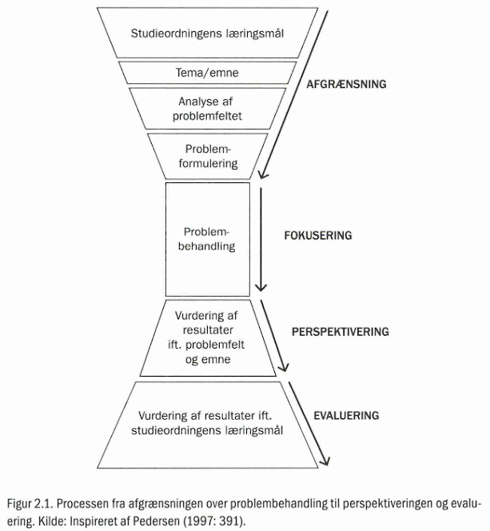
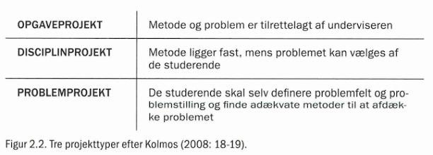

- #PBL
	- #INDHOLD
		- #INDLEDNING	7
		- #Bogensintentioner	7
		- #Bogensstruktur	11
		- #Læsningafbogen	13
		- #KAPITEL1 · HVAD ER PROBLEM BASERET LÆRING?	15
		- Hvorfor PBL ved de videregående uddannelser?	15
		- Overordnede principper for problembaseret læring	18
		- Hvad betyder en PBL-tilgang konkret for dig som studerende?	27
		- Afrunding	29
		- #KAPITEL2 · OM PROBLEMER OG PROBLEMFORMULERINGER	31
		- Problemformuleringen - projektets første og sidste skridt	32
		- Afgrænsning af problemet	39
		- Fra problemfelt til problemformulering	43
		- Problemformuleringen som projektets kompas	44
		- Den gode problemformulering	46
		- 10 skarpe om problemformuleringen	49
		- Afrunding	52
		- #KAPITEL3 · AT PLANLÆGGE OG STYRE ET PBL-PROJEKT	55
		- Afgrænsning af problemet via Mind Map	55
		- Mål/middeldiagram	58
		- Tidsplanlægning - flowdiagram	60
		- Backcasting	62
		- Arbejdsorganisering - Gantt-skema	63
		- Fordeling af arbejdet	67
		- Afrunding	72
		- #KAPITEL4 · OPSTART AF SAMARBEJDET	73
		- Godt begyndt - halvt fuldendt	74
		- Projektgruppen som organisatorisk enhed og praksisfællesskab	75
		- Forventningsafklaring er første skridt	78
		- Fra forventningsafstemning til samarbejdsaftale	81
		- Samarbejdsaftalen med vejleder	83
		- Afrunding	88
		- #KAPITEL5 · SAMARBEJDE - FRA HENSIGT TIL HANDLING	89
		- Samarbejde som et samspil af roller	89
		- Om arbejdsgrupper, hyggegrupper og dysfunktionelle grupper	93
		- Kommunikationen i gruppen	96
		- Konflikter i gruppen	102
		- Konflikthåndtering	104
		- Afrunding	110
		- #KAPITEL6 · PBL OG IT	113
		- Hvorfor bruge it i projektarbejdet og hvordan?	114
		- Udforskning af undersøgelsesfeltet	117
		- Ressourcehåndtering (opbevare, gemme og annotere)	120
		- Dialog	123
		- Afrunding	131
		- #KAPITEL7 · EVALUERING AF DET PROBLEM BASEREDE ARBEJDE	133
		- Hvad er evaluering?	134
		- Om feedback i evaluering	136
		- Om at sætte mål og evaluere	140
		- Evalueringsforhold	142
		- Den løbende evaluering	144
		- Den afsluttende evaluering	148
		- Afrunding	152
		- #KAPITEL8 · PBL I ARBEJDSLIVET	155
		- PBL i videnssamfundet	155
		- Afrunding	162
		- FORFATTERPRÆSENTATION	165
		- LITTERATUR	167
		- INDEKS	173
	- #INDLEDNING
	  collapsed:: true
		- Denne bog er til dig, der gerne vil vide mere om det at arbejde pro­ blembaseret og projektorganiseret. Det kan være, fordi du er påbe­ gyndt en videregående uddannelse, hvor undervisningen er tilret­ telagt ud fra dette perspektiv. Det kan også være, at du allerede har erfaring med problembaseret arbejde på din ungdomsuddannelse, men søger ny inspiration og nye værktøjer, der kan bidrage til at kvalificere og udvikle dit arbejde yderligere på en videregående ud­ dannelse. Bogen kan også danne afsæt for tilrettelæggelse af under­ visning, der skal klæde studerende på til at arbejde i problembase­ rede grupper, og den er dermed ligeledes tænkt som et redskab for underviseren, der skal formidle den problembaserede tilgang til læ­ ring.
	- #Bogensintentioner
	  collapsed:: true
		- På både ungdomsuddannelser, mellemlange og lange videregående uddannelser arbejder man som regel på et tidspunkt med større op­ gaver eller projekter, der i større eller mindre grad kan kaldes pro­ blembaserede. Sådanne projektforløb kan struktureres og gennem­ føres på mange forskellige måder, hvilket også bliver synligt i denne bog. Bacheloropgaver og specialer er gode eksempler på længere pro­ jektforløb, der kan foregå både individuelt og i grupper. Derfor ret­ ter denne bog sig ikke udelukkende mod studerende og undervisere ved såkaldte problembaserede uddannelsesinstitutioner, som ek­ sempelvis Aalborg Universitet og Roskilde Universitet, men henven­ der sig bredt til studerende, der skal i gang med et projektarbejde, og som ønsker inspiration til at styre og organisere læreprocessen selv­ stændigt og i grupper.
		- PBL er forkortelsen af problembaseret læring, hvilket er en betegnelse, der bruges både i danske og internationale sammenhænge. PBL henviser til arbejdssituationer, der tager afsæt i autentiske pro­ blemstillinger og er kendetegnede ved de studerendes selvstændige organisering af dette arbejde. Bogen indeholder en indføring i de væsentligste principper bag PBL og giver samtidig en grundig in­ troduktion til de vigtigste elementer i det problembaserede projek­ tarbejde, sådan som det praktiseres i de danske uddannelsesinsti­ tutioner. Bogen indeholder også en række forslag og anvisninger til, hvorledes et projektarbejde kan struktureres og gennemføres fra den indledende problemidentifikation til den afsluttende evaluering, ef­ ter eksamen er gennemført.
		- At studere med afsæt i PBL er en aktiv proces, som kræver enga­ gement. PBL tager afsæt i den studerende og ikke et forudbestemt pensum. Det betyder, at man selv er med til at identificere det pro­ blem, man gerne vil undersøge nærmere, og måden, hvorpå man gerne vil finde frem til mulige løsninger og nye forståelser. Arbejds­ formen opleves ofte som intens og krævende, men samtidig oplever mange, at det problembaserede arbejde giver energi, er fagligtinte­ ressant, meningsfuldt og vedkommende. Mange studerende trives med læringsformens store frihedsgrader, der fx betyder, at man som studerende har stor indflydelse på, hvilke faglige emner man fordy­ ber sig i. Således er der gode muligheder for at opbygge solide fag­ lige kompetencer inden for netop de områder, man har særlig inte­ resse for, samtidig med at grundlæggende teorier og metoder afprø­ ves. Som studerende har man mulighed for at skabe sin egen faglige profil, men samtidig må man tage ansvar for egen læring og udvik­ ling gennem hele studietiden.
		- Gennem årene er der skrevet en række bøger og artikler, der på forskellig vis behandler den praktiske organisering af problembase­ ret læring såvel som den teoretiske og politiske begrundelse for val­ get af PBL (se fx Kolmos, Fink og Krogh 2004; Krogh, Brødslev Ol­ sen og Rasmussen 2008; Mac og Hagedorn-Rasmussen 2013). Imid­ lertid oplever vi som undervisere inden for PBL, at der mangler en bog, der kan favne det problembaserede arbejde, som det udmøntes på tværs af studieretninger, fakulteter og uddannelsesinstituti­ oner. Samtidig er det vores oplevelse, som undervisere og vejledere, at studerende oplever det problembaserede og projektorganiserede arbejde som udfordrende og til tider kaotisk - særligt som ny stu­ derende uden forudgående kendskab til arbejdsformen. Hensigten er, at man med denne bog i hånden kan opnå et indblik og få nogle redskaber, der kan understøtte den enkelte studerende såvel som en samlet projektgruppe.
		- Meget af litteraturen om PBL er skrevet med afsæt i specifikke faglige områder og behandler særlige forhold omkring det at arbejde problembaseret inden for områder som fx ingeniørvidenskaberne eller samfundsvidenskaberne. Grundlæggende bygger denne littera­ tur på de samme perspektiver på læring og det problembaserede ar­ bejde, men sproget inden for de forskellige fagfelter varierer betyde­ ligt. Samtidig praktiseres PBL på forskellig vis på forskellige uddan­ nelser, og PBL har således ikke en bestemt udtryksform. Det er en styrke, at PBL kan tilpasses, så den passer ind i en bred vifte af stu­ dieretninger. På den anden side er det også med til at komplicere og skabe forvirring omkring, hvad PBL egentlig indebærer. Dette er baggrunden for, at vi har ønsket at skrive denne bog. Bestræbelsen er, at studerende på både mellemlange og lange videregående ud­ dannelser skal kunne finde bogen anvendelig. Det har derfor været vigtigt at skrive en bog, der er relevant for såvel en studerende på idrætsstudietsomen studerende, der læser til pædagog, ingeniør el­ ler psykolog. Bogens indhold kan på den baggrund siges at være af almen karakter, og vi har udvalgt områder, som i udgangspunktet er relevante, uanset hvilken uddannelse man tager. Derfor kan der være emner, som er relevante for netop den specifikke uddannelse, man er i gang med, der ikke berøres i bogen, ligesom der også kan være forskellige måder, hvorpå man kan tale om det problembase­ rede arbejde. Nogle løser problemer, mens andre belyser problem­ stillinger, nogle arbejder individuelt, mens andre arbejder i grupper, nogle arbejder med mange mindre forløb (fx cases) igennem et se­ mester, mens andre arbejder med et stort projekt osv.
		- På denne vis kan bogen siges at være relevant for mange stude­ rende, men samtidig er det vigtigt at være opmærksom på, hvor og hvordan man på det enkelte studie arbejder med PBL, samt hvordan ens studie adskiller sig fra den mere generelle tilgang, der er beskre­ vet i bogen. Bogen er ikke tænkt som en erstatning for en lokalt for­ ankret PBL-tilgang, men derimod som et supplement. Det er således undervisernes og vejledernes opgave at nuancere bogens udgangs­ punkt inden for de forskellige fagdomæner.
		- Ønsket om at skrive en bog, der ikke retter sig mod et specifikt
		- fagligt felt, men mod PBL i bred forstand, afspejles også i forfatter­ gruppens sammensætning, idet Nikolaj Stegeager og Thomas Ry­ berg er ansat på Det Humanistiske Fakultet, Jette Egelund Holga­ ard er ansat på Det Teknisk/Naturvidenskabelige Fakultet og Diana Stentoft på Det Sundhedsvidenskabelige Fakultet, mens Anja Over­ gaard Thomassen er ansat på Det Samfundsvidenskabelige Fakultet. Grundet vores tilknytning til forskellige faglige miljøer på Aalborg Universitet, og dermed også forskellige PBL-traditioner, har vi bragt forskellige erfaringer og perspektiver ind i arbejdet med denne bog. Vi finder, at dette er en styrke ved bogen, idet arbejdet i høj grad har været tværfagligt. Med forskelligheden som afsæt har vi bestræbt os på at udvikle et fælles sprog og afsæt for PBL.
		- Endeligt er det vigtigt igen at understrege, at hensigten med bo­
		- gen er at give en grundig introduktion til de vigtigste områder i det problemorienterede projektarbejde. Vi har søgt at skrive en bog, der både giver et godt overblik, og som er anvendelig og overskuelig. En bog, man kan tage frem, når man står over for et nyt problem eller en ny udfordring, og som man kan vende tilbage til på forskellige tidspunkter i uddannelsen. Vores bestræbelse på at lave en bog, der retter sig specifikt mod PBL, har medført, at der er visse områder, der er udeladt. Det drejer sig om emner, som ikke specifikt knytter sig til det problembaserede arbejde, men til det grundlæggende i at skrive en akademisk opgave. Specifikt er det især spørgsmål om vi­ denskabsteori, forskningsmetode samt akademisk skrivning og for­ midling, der er udeladt. Der findes dog allerede en række gode publikationer om disse emner, som det i høj grad er relevant, at man for­ holder sig til og anvender, når man skal udarbejde et skriftligt pro­ dukt i forbindelse med et PBL-projekt, hvilket vi vender tilbage til i kapitel 2.
	- #Bogensstruktur
	  collapsed:: true
		- Det problembaserede arbejde gennemløber ofte en række forskellige faser fra opstart til afslutning, og forskellige emner er således rele­ vante på forskellige tidspunkter i forløbet. Det, der ved begyndelsen synes svært, bliver rutine i takt med, at nye udfordringer opstår. Bo­ gens kapitler er udformet således, at de i hovedtræk følger struktu­ ren i et typisk problembaseret projektarbejde. Dog er der i projekt­ arbejdet også emner af mere gennemgående karakter, som er mindst lige så relevante i kortere forløb, eller hvis læringen er tilrettelagt omkring problembaserede caseforløb.
		- Oftest foregår det problembaserede arbejde i mindre grupper, hvorfor de gennemgående fokuspunkter i kapitlerne er samarbejde, koordinering, uddelegering og evaluering af samarbejdet. Samtidig er vi naturligvis opmærksomme på, at det langt fra er alle stude­ rende, der igangsætter et PBL-projekt, som arbejder i grupper. Nogle projekter skal ifølge den gældende studieordning udarbejdes alene, mens der i andre tilfælde kan være .mere individuelle grunde til ikke at skrive i en gruppe. Et projektforløb indeholder dog som hovedre­ gel de samme elementer. Man støder på de samme udfordringer, og man gennemløber mange af de samme processer, uanset om man skriver i gruppe eller alene. Bogen er derfor relevant både for stude­ rende, der skriver i grupper, og for studerende, der skriver individu­ elt.
		- I kapitel 1, *Hvad er problembaseret læring?, *giver vi en intro­duktion til de pædagogiske og didaktiske principper, som ligger til grund for PBL. Endvidere beskriver vi det historiske grundlag for, at PBL blev introduceret på danske uddannelsesinstitutioner. Som stu­ derende er det relevant at kende til tankerne, der ligger bag den pæ
		- dagogiske tilgang, fordi det bidrager til en helhedsforståelse af må­ den, hvorpå undervisningen og projektarbejdet er struktureret.
		  Kapitel 2, *Om problemer og problemformuleringer, *sætter fokus på selve omdrejningspunktet for at arbejde problembaseret - nem­ lig problemet. Kapitlet præsenterer en almen problemforståelse, og med dette udgangspunkt beskrives forskellige problem- og projekt­ former. Endvidere diskuterer og beskriver vi, hvordan man afgræn­ ser sit problemfelt, hvorved det bliver muligt at stille spørgsmål til problemfeltet og at lave en problemformulering. Problemformule­ ringen er yderst central i projektarbejdet, eftersom den fungerer som projektets retningsgiver og er med til at skabe den røde tråd i opga­ ven. Derfor giver kapitlet en række bud på, hvilke kvaliteter der ka­ rakteriserer "den gode problemformulering".
		- Kapitel 3, *At planlægge og styre et PBL-projekt, *beskriver, hvor­ ledes man kan lede et projekt fra start til slut. Særligt i forbindelse med længerevarende projekter kan det være svært at bevare over­ blikket, hvorfor det kan være en god ide at arbejde bevidst med at planlægge og strukturere arbejdet. Imidlertid kan grundig planlæg­ ning ved korterevarende projekter, hvor meget skal nås på lidt tid, også være gavnlig. Kapitlet præsenterer en række projektstyrings­ modeller og værktøjer, der kan effektivisere processen og samti­ dig sikre, at de valg og fravalg, der er en del af ethvert projektforløb, foretages på baggrund af en velovervejet strategi.
		  Kapitel 4, *Opstart af samarbejdet, *er det første af to kapitler, som sætter fokus på samarbejde i grupper, der arbejder problembaseret. I dette kapitel fokuserer vi på, hvordan gruppen kan danne en god platform for samarbejdet ved at foretage en forventningsafklaring og udarbejde en samarbejdsaftale - både for samarbejdet i grup­ pen og med vejleder. Som udgangspunkt for at få drøftet relationen imellem vejleder og gruppe præsenterer vi et værktøj til at illustrere gruppens forventninger til vejledningen i de forskellige faser af et prajektforløb.
		  I kapitel 5, *Samarbejde *- *fra hensigt til handling, *understreges be­ tydningen af, at gruppen løbende er opmærksom på at arbejde med
		- at finjustere og optimere samarbejdet. Kapitlet diskuterer, hvad der kendetegner en velfungerende arbejdsgruppe, og der gives konkrete bud på, hvordan gruppen kan vedligeholde og udvikle gruppesam­ arbejdet igennem kommunikation og om nødvendigt konflikthånd­ tering.
		  I kapitel 6, *PBL **og **it, *rettes fokus mod, hvordan gruppen - og den enkelte studerende - kan gøre brug af it i relation til et PBL-pro­ jekt. It relateres mere konkret til, hvordan det kan benyttes til ud­ forskningen af et undersøgelsesfelt, ved ressourcehåndtering, til dia­ log samt i skriveprocessen til deling og dokumenthåndtering. Gen­ nemgående sættes der fokus på, at effektiviteten af it hænger sam­ men med hensigtsmæssig brug, enighed og forhandling af, hvordan man skal bruge teknologierne i forbindelse med arbejdet.
		- Kapitel 7, *Evaluering af det problembaserede projektarbejde, *be­ skriver, hvorledes man som. individ eller gruppe kan arbejde med evaluering gennem hele det problembaserede projektforløb. Evalu­ ering kan være mange ting, og man kan evaluere på mange forskel­ lige måder. I kapitlet pointeres det, at systematisk evaluering under­ vejs i forløbet i langt de fleste tilfælde vil medvirke til at forbedre processen og produktet og dermed også resultatet af den afsluttende evaluering. Kapitlet giver en række konkrete forslag til, hvor og hvordan man kan evaluere, og præsenterer forskellige evaluerings­ skemaer og -modeller.
		- Med kapitel 8, *PBL **i **arbejdslivet, *der er bogens afsluttende kapi­
		- tel, flyttes fokus væk fra det problembaserede arbejde under studie­ tiden og over mod tiden, der følger efter studiet. I dette kapitel ser vi på, hvilke færdigheder og kompetencer som deltagelse i problemba­ seret projektarbejde kan føre med sig, og som har interesse for er­ hvervslivet.
	- #Læsningafbogen
	  collapsed:: true
		- Bogen kan læses kronologisk fra første til sidste side, men det emne­ opdelte indhold muliggør også, at man som læser vælger ud og hopper frem til kapitler, der er relevante i en konkret situation. Under­ vejs i bogen henvises der til bogens andre kapitler - dels for at illu­ strere sammenhængen mellem de forskellige elementer af det pro­ blembaserede arbejde, dels for at vise sammenhængen mellem ar­ bejdsprocessen og det produkt, man søger at realisere. God fornøjelse med læsningen, og held og lykke med det problem­ baserede arbejde!
	- #KAPITEL1 ^^15^^
	  collapsed:: true
		- **HVAD** **ER** **PROBLEMBASERET** **LÆRING?** ^^15^^
		  collapsed:: true
			- "Hvad er problembaseret læring?" og "Hvorfor skal vi arbejde pro­ blembaseret?" er nogle af de spørgsmål, som ofte møder undervi­ sere, vejledere og sekretærer, når nye studerende træder ind på de­ res videregående uddannelser. Nogle studerende har på forhånd un­ dersøgt, hvordan deres studie er tilrettelagt og har måske gjort sig tanker om, hvordan det vil være at arbejde problembaseret, og nogle har måske rig erfaring med at arbejde med projekter eller at arbejde problembaseret. Andre studerende oplever en vis overraskelse over, at rammerne for læring og undervisning måske slet ikke ligner det, de har været vant til i ungdomsuddannelsen. Det er derfor meget re­ levant at spørge: «Hvad er problembaseret læring, og hvad skal vi med det?"
			- I de efterfølgende afsnit vil vi komme nærmere ind på de mange facetter ved det problembaserede arbejde og derigennem vise, hvad man som studerende kan forvente, når man står over for at skulle arbejde problembaseret. Før vi tager fat i en mere detaljeret præsen­ tation af PBL, er det dog relevant at se nærmere på, hvad det er for strukturelle rammer og perspektiver, der ligger til grund for, at en række danske uddannelsesinstitutioner, med Aalborg Universitet og Roskilde Universitet som de tidligste, har valgt en problembaseret tilgang til læring.
			- **Hvorfor PBL ved de videregående uddannelser?** ^^15^^
			  collapsed:: true
				- PBL blev først introduceret ved de videregående uddannelser på me­ dicinstudiet på McMaster University i Canada tilbage i 1969 (Lee og Kwan 1997). Grunden var, at man mente, at de medicinstude­ rende ikke i tilstrækkelig grad kunne *anvende *deres tillærte viden
				- ^^16^^ og tidligere lærdom, når de kom ud i en klinisk praksis med virke­ lige patienter og komplekse problemer. Dette førte til et ønske om, at universitetsuddannelsen inden for medicin blev struktureret på en måde, der i højere grad understøttede de studerendes udvikling af andet og mere end kompetencen til at læse og huske komplekse me­ dicinske begreber (Schmidt 1983). Man ønskede således, at de stude­ rende, også i deres første år på universitetet, skulle udvikle kompe­ tencer til problemløsning, håndtering af kompleks og omfattende vi­ den, kommunikation og samarbejde, og man søgte at gøre dette ved at introducere problembaserede cases som afsæt for deres læring. Via patientcases skulle de studerende selvstændigt, og i små grup­ per, udlede relevante problemstillinger, undersøge disse ved at søge relevant litteratur og andre kilder og finde frem til mulige årsager, forklaringer og løsninger, som de afslutningsvis skulle være i stand til at præsentere. Den problembaserede tilgang har siden spredt sig til andre universiteter rundt om i verden og til en række andre fag­ lige retninger.
				- PBL blev første gang introduceret ved danske universiteter ved etableringen af Roskilde Universitetscenter i 1972. To år senere blev Aalborg Universitet grundlagt, ligeledes ud fra en PBL-filosofi. I dag er hele eller dele af uddannelser tilrettelagt med udgangspunkt i PBL ved en række videregående uddannelsesinstitutioner, og i både fol­ keskole og ungdomsuddannelser arbejdes der i stigende grad med projekter og problemer. Da universiteterne i Roskilde og Aalborg valgte den problembaserede tilgang, lå der både læringsteoreti­ ske og politiske/samfundsmæssige begrundelser bag, der samlet set gjorde, at PBL-tilgangen virkede særlig attraktiv i en tid, hvor flere unge skulle ind på de videregående uddannelser, og hvor der blev sat spørgsmålstegn ved universiteterne og universitetsunderviser­ nes autoritet. I den problembaserede tilgang fandt man en tilgang, der eksempelvis kunne understøtte øget studenterindflydelse, de­ mokratisering af, hvad og hvorfor der skulle læres, samt nye måder at tænke uddannelse på. Præmisserne for videregående uddannelse har således forandret sig betragteligt gennem det seneste halve århundrede.
				- ^^17^^ Universiteterne er gået fra at være forbeholdt eliten og de bedrestillede grupper i samfundet til at være uddannelsesinstitutio­ ner for en stadig større og bredere del af befolkningen. 
				  
				  Samtidig har samfundsstrukturerne forandret sig markant. Ek­ sempelvis er adgangen til og omfanget af information øget vold­ somt, og i takt hermed opleves samfundet stadig mere komplekst. Allerede i 1970'erne fremhævede danske uddannelsesforskere, hvor­ dan samfundets omskiftelighed og krav om øget effektivitet ville få betydning for tilrettelæggelsen af uddannelser (Berthelsen, Illeris og Poulsen 1977). Det handler dels om at kunne sortere i en overvæl­ dende informationsmængde, dels om at kunne rumme kompleksi­ tet og vide, hvordan man kan arbejde på tværs af discipliner og vi­ densområder i bestræbelsen på at forstå og håndtere kompleksite­ ten. Endelig er videregående uddannelse også blevet en platform, der skal ruste de studerende til at fortsætte deres læring efter endt ud­ dannelse. Begrebet "livslang læring" står centralt i erkendelsen af, at eksisterende viden hastigt forældes, og virksomheder og organisati­ oner har behov for medarbejdere, der løbende kan identificere, til­ egne sig og anvende ny viden. 
				  
				  Kravet om øget effektivitet og håndtering af komplekse og om­ 
				  
				  skiftelige vidensområder udgør i høj grad rammerne omkring nuti­ dens videregående uddannelsesinstitutioner. 
				  
				  Således kan vi pege på en række ønsker og krav, som er motiveret af politiske og samfundsmæssige udviklinger og tendenser, der lig­ ger til grund for en problembaseret tilgang til læring:
					- Krav om øget effektivisering og innovation på tværs af videns­ områder.
					- Bedre sammenhæng mellem forskning og uddannelsestilbud.
					- Ønsket om, at studerende i løbet af deres uddannelse ikke blot opnår stor faglig indsigt, men at de også udvikler kompetencer inden for kommunikation og samarbejde og til at arbejde selv­ stændigt med komplekse problemer og projekter.
					- ^^18^^ Studerende skal være lærende hele livet, og de må derfor tilbydes  mulighed for at udvikle kompetencer, der gør dem i stand til selvstændigt at identificere læringsbehov og handle ud fra disse behov efter endt uddannelse.
					- Bedre sammenhæng mellem uddannelsesinstitution/universitet og det omkringliggende samfund.
				- Vi vender i dette og i det afsluttende kapitel yderligere tilbage til cen­ trale kompetenceområder, som det er meningen, at man som stude­ rende kan erhverve sig igennem en PBL-tilgang. Med rammerne de­ fineret og scenen sat dykkes der nu lidt dybere ned i de principper, som ligger til grund for, at både undervisere og studerende kan til­ rettelægge arbejdet med udgangspunkt i PBL.
			- **OVERORDNEDE PRINCIPPER ****FOR ****PROBLEMBASERET ****LÆRING** ^^18^^
			  collapsed:: true
				- ^^18^^ Det problembaserede arbejde kan i praksis organiseres på mange måder og under meget forskelligartede organisatoriske rammer. Aalborg Universitet og Roskilde Universitet har valgt at organisere væsentlige dele af deres uddannelser omkring det problembaserede og projektorienterede arbejde. Her arbejder de studerende en be­ tragtelig del af hvert semester med at udforme et omfattende pro­ jekt, der tager udgangspunkt i en relevant problemstilling og afslut­ tes med eksamen. Ved nogle universitetsuddannelser anvendes en problembaseret tilgang til læring med udgangspunkt i de studeren­ des arbejde med casematerialer. Her er det fortsat de studerende, der i fællesskab afgrænser problemstillingerne, men forløbene er flere og kortere, typisk en uge, og afsluttes med fremlæggelse og diskussion. Fælles for de forskellige praksisser for PBL er dog, at man ud over projektarbejdet tilbydes supplerende måder at lære på, som eksem­ pelvis kurser organiseret omkring seminarer, workshops eller fore­ læsninger. Viden opnået gennem disse aktiviteter anvendes ofte som afsæt for projektarbejdet.
				- ^^19^^ Problembaseret læring er en udfordrende, men også givende affære, der stiller krav både til de studerendes håndtering af fagligt stof og til deres etablering og fastholdelse af frugtbare arbejdsrela­ tioner. Det kan måske umiddelbart forekomme som en stor opgave, men erfaringerne er, at langt de fleste studerende ganske hurtigt fin­ der sig til rette i arbejdsformen. For at give mere mening og struk­ tur til en opstart, der indeholder mange nye elementer, er det vig­ tigt, at studerende, der arbejder problembaseret på deres uddannel­ ser, også har indsigt i, hvorfor denne læringstilgang er valgt. Herved bliver det tydeligt, hvilke intentioner og hensigter der er indbygget i tilgangen i forhold til de kompetencer, man som studerende skal stå med efter endt uddannelse. I en problembaseret tilgang til læring er der et indbygget ønske om, at man som studerende ikke blot tilegner sig en dyb faglig viden, men at man også kan forholde sig til:
					- Hvilke problemstillinger der er relevante at adressere
					- Hvilken viden der skal understøtte problembehandlingen
					- Hvordan denne viden kan anvendes i praksis
					- Hvordan der kan bygges videre på den viden, man allerede har
					- Hvordan man kan arbejde sammen med andre om at skabe ny viden
					- Hvordan man også efter endt uddannelse kan arbejde for at lære mere, i takt med at nye behov for viden melder sig i arbejdslivet.
				- Grundlæggende hersker der en vis enighed om de fælles karakte­ ristika for læring, der danner udgangspunktet for PBL ved videre­ gående uddannelser (se fx Barrows 1996; Illeris 1974; Savin-Baden og Major 2004; Graaff og Kolmos 2007; Kjær-Rasmussen og Jensen 2013). PBL er således kendetegnet ved:
					- Læring organiseret omkring virkelige og komplekse problemer, der knytter teori til praksis
					- Det videnskabelige arbejde, de studerende udfører, er eksempla­ risk
					- ^^20^^ Viden er ikke noget, man får overleveret, men skabes i en aktiv læreproces
					- En læreproces, der tager udgangspunkt i de studerendes aktive deltagelse og medinddragelse
					- Læring foregår i grupper
					- Undervisere fungerer som vejledere
					- De studerende er ansvarlige for organiseringen af deres egen læ­ ring.
				- Ved at se lidt nærmere på ovenstående kendetegn kan man få en god fornemmelse af, hvad PBL er, og hvordan PBL kan sætte rammerne for læring.
				- **Virkelige og ****komplekse ****problemer der knytter teori ****til** **praksis** ^^20^^
					- Når man arbejder problembaseret, er det en virkelighedsnær og kompleks problemstilling, der danner baggrund for arbejdet med et fagligt område. Det er de studerende selv, der ud fra et bredere tema eller mere afgrænsede casematerialer identificerer relevante pro­ blemstillinger som afsæt for et kortere eller længerevarende projek­ tarbejde. De bredere temaer for arbejdet er typisk angivet i uddan­ nelsens studieordning, og der vil ligeledes være kursusrækker, fore­ læsninger og seminarer, som skal understøtte de studerende i at op­ bygge en både grundlæggende og avanceret teoretisk og metodisk viden inden for et fagfelt samt understøtte det videre problembase­ rede arbejde.
					- Som studerende skal man dog aktivt opsøge problemet, og pro­ blemstillinger er således ikke altid noget, der udleveres af en under­ viser, selvom dette også kan være tilfældet. At identificere et rele­ vant problem kræver ofte et forudgående arbejde, hvor man afdæk­ ker, hvorfor det kan være vigtigt at arbejde med et specifikt problem, hvem der kan have interesse for arbejdet, hvad der tidligere er gjort inden for samme område osv. (læs mere om problemer i #KAPITEL2 ). Problemet skal dermed forstås i en større sammenhæng, og det er via denne forståelse,
					- ^^21^^ at broen mellem teori og praksis kan bygges, fordi problemet oftest springer ud af en praksis, der kræver nærmere teoretisk fundering og empirisk undersøgelse.
				- **Et** **projekt** **på** **første** **semester** ^^21^^
					- En gruppe idrætsstuderende skal på første semester skrive et pro­ jekt inden for temarammen "Sundhedsprofiler". I gruppen er de ble­ vet opmærksomme på, at der netop er udgivet en rapport, der viser, at stadig flere unge i alderen 16-19 år bliver overvægtige. Gruppen beslutter derfor, at det vil være både relevant og motiverende at se på sundhedsprofiler for unge ved erhvervsuddannelserne, hvor der ikke er obligatorisk idræt på skemaet. Gruppen ønsker at finde ud af, om unge på erhvervsuddannelserne følger den generelle tendens blandt unge i forhold til BMI, kost og motion. For at realisere projek­ tet tager gruppen kontakt til en erhvervsskole, hvor det viser sig, at man allerede er opmærksom på unges stigende vægt, og man er derfor meget interesseret i at samarbejde og i undersøgelsens re­sultater.
					- I eksemplet ses, hvordan en fagligt relevant problemstilling kan knytte teori og praksis tættere sammen. Det ses også, at det er via de studerendes undren og undersøgelse, at problemstillingen træder frem. I det videre arbejde med projektet vil det være denne problem­ stilling, der danner udgangspunktet for, hvad der skal læses, hvor­ dan der skal undersøges, og hvad der kan konkluderes. I eksemplet må de studerende teoretisk undersøge sammenhænge mellem kost, motion og vægt. De må vælge metoder, der er relevante for deres un­ dersøgelse af elever ved erhvervsuddannelserne, og de må finde red­ skaber og strategier, der kan hjælpe dem med at knytte teori og em­ piri sammen i en analyse, som leder frem til undersøgelsens resul­ tater.
					- En del af denne proces handler om, at man i gruppen kortlægger, hvilke teorier, metoder og eksisterende viden gruppen må arbejde med for at kunne undersøge problemet på en meningsfuld måde. For eksempel vil en gruppe studerende, der skal undersøge, hvordan
					- ^^22^^ man kan styrke udviklingen af professionsidentiteter på lærerud­ dannelsen, først afklare, hvad de ved om begrebet «professionsiden­ titet», hvad de ved om læreruddannelsens organisering, hvad de ved om udvikling af identitet osv. Ud fra denne viden kan de tage stilling til, hvilke kilder det er nødvendigt at undersøge, samt hvilke under­ søgelser de evt. selv må gennemføre. Det er med andre ord ikke spe­ cifikke fagbøger eller underviseren, der alene definerer pensum el­ ler fremgangsmåde. Det er de studerendes eksisterende erfaring, sat i sammenhæng med det, de erkender, at de ikke ved om problemet, der gør det tydeligt for dem, hvad det er relevant at fordybe sig i.
					- At lade de studerende identificere og afgrænse problemet og der­ med være med til at definere, hvad der udgør relevant akademisk vi­ den, er et af de centrale principper for en problembaseret uddan­ nelse. I nogle ungdomsuddannelser ligger beslutningen om, hvad der er relevant viden, i højere grad hos underviseren og afgrænses af en fast pensumopgivelse. Det er i denne forskel, mange studerende oplever en vis udfordring, når de begynder at arbejde problembase­ ret, fordi de selv tilbydes en mulighed og pålægges et ansvar for at definere området for deres arbejde (inden for de rammer, der er an­ givet for studiet). Dette står for nogle i modsætning til tidligere er­ faringer med uddannelse, hvor man måske primært har forholdt sig til pensum og fastlagte opgaver. Til gengæld er det også netop i iden­ tifikationen af et meningsfuldt problem, at mange studerende fin­ der den største arbejdsglæde, fordi de selv har indflydelse på, hvilke bøger de læser, og fordi de via arbejdet med selvidentificerede pro­ blemer får lejlighed til at afprøve mange af de teorier og metoder, de præsenteres for i uddannelsens kurser på virkelige og fagligt rele­ vante problemer.
				- **Det videnskabelige arbejde, de studerende udfører, er eksemplarisk** ^^22^^
					- Problembaseret arbejde med såvel projekter som cases giver mu­ lighed for fordybelse inden for helt afgrænsede problemstillinger.
					  Det skaber dybde i arbejdet, men for samtidig at sikre den faglige
					- ^^23^^ bredde i en uddannelse er et helt centralt princip for PBL, at de stu­ derende skal arbejde med problemstillinger, der muliggør eksempla­ ritet. At arbejde eksemplarisk betyder, at den faglige indsigt og de erkendelser, man gør sig i forbindelse med en konkret problemstil­ ling, skal hæves op på et bredere abstrakt begrebsligt niveau, således at de også kan anvendes på lignende, men ikke nødvendigvis iden­ tiske problemstillinger i andre sammenhænge (Illeris 1974). Projek­ terne skal med andre ord indeholde viden og fremgangsmåder, som kan finde mere bred anvendelse. At arbejde eksemplarisk indebærer derved også, at den enkelte får en evne til at situere indhold og frem­ gangsmåder (Klafki 1985) - altså får en evne til at kunne argumen­ tere for, i hvilke situationer hvilken viden, teori og metode vil kunne finde anvendelse og på hvilke måder.
					- Ser vi på eksemplet, hvor nogle idrætsstuderende skulle udforme et projekt inden for temarammen «Sundhedsprofiler,,, betyder ek­ semplariteten i arbejdet, at de studerende efter afsluttet projektar­ bejde vil være i stand til at anvende teorier, metoder og analyseper­ spektiver på tilsvarende projekter om sundhedsprofiler, hvor mål­ gruppen ikke er unge på en erhvervsuddannelse. Med andre ord kan man sige, at de studerende ikke blot får indsigt i sundheden blandt unge på erhvervsuddannelser, de får også viden om begreber som BMI, sammenhæng mellem kost og motion, undersøgelsesmetoder osv., der rækker langt ud over den konkrete undersøgelse, og som vil være relevant i mange andre dele af deres idrætsstudie og videre arbejdsliv.
				- **Læring** **sker** **ved** **de** **studerendes** **aktive** **deltagelse** ^^23^^
					- organiseret omkring PBL handler om at tilbyde stude­ rende muligheder for aktivt at kunne lære med afsæt i inddragelse af tidligere erfaringer. Her spiller arbejdet med studenterdefine­ rede problemer en central rolle. Det er det afgrænsede problem kob­ let til tidligere erfaringer, faglige materialer, fremadrettede handlin­
					- ger som fx undersøgelser samt de studerendes interaktion og fæl­ les bearbejdning af alle disse elementer, der samlet set danner rammen ^^24^^ for skabelsen af den nye viden (Gijselaers 1996). Videnskabelse, og dermed læring, sker i en proces, der aktivt involverer den stude­ rende i handling, og vender vi tilbage til det tidligere eksempel, er det tydeligt, at den viden, der blev skabt i PBL-forløbet, kun kunne skabes som resultat af de studerendes handlinger og refleksioner. De studerende kunne gå til forelæsninger og opnå en grundlæggende forståelse af teorier, metoder og unges generelle sundhed, hvorimod begrebernes indbyrdes relationer og anvendelse kræver handling og ikke mindst refleksion.
					- Et PBL-forløb vil derfor være tilrettelagt med en forventning om, at man som studerende deltager aktivt, og ofte vil den enkeltes ud­ bytte af undervisningen direkte afhænge af, hvordan man engagerer sig. Et sådant udgangspunkt taler for, at de studerende tager aktiv del i uddannelsesaktiviteterne og skaber deres egne erfaringer. Det kan eksempelvis være særdeles udbytterigt at bidrage til en diskus­ sion eller formulere spørgsmål omkring et fagligt problem. Begge dele giver nemlig mulighed for, at man som studerende tilegner sig og lærer at arbejde med akademiske begreber og metoder i relation til konkrete problemer.
					- Men et er, at man er aktiv, mens man lærer, noget andet er, hvor­ vidt man har indflydelse på indholdet og fremgangsmåden i lære­ processen. Hvis læreprocessen er studentercentreret, fordrer det, at de studerende har væsentlig indflydelse på, hvad og hvordan de læ­ rer. Dette ud fra et perspektiv om, at man lærer bedre, hvis man op­ fatter det, der læres, som relevant og vedkommende (Rogers 1969). Samtidig giver studentercentreret læring også de studerende mu­ lighed for at påvirke undervisningen via deres deltagelse, og dette medvirker til, at de studerende kan opnå ejerskab og indflydelse i undervisnings situationen.
					- Ud over at aktiv deltagelse er en forudsætning for at lære, så er det også en motiverende måde at lære på. Den indre motivation, som kendetegner den studentercentrerede læring, er afgørende fo , at man som studerende kan opnå en dyb tilgang til læring. En dyb
					- ^^25^^ tilgang til læring ses, når studerende arbejder med det faglige stof, fordi de finder det meningsgivende og ønsker at forstå og anvende stoffet (Biggs og Tang 2007). Dette ses eksempelvis i arbejdet med projekter, hvor de studerende driver deres læreproces frem af nys­ gerrighed og motivation for at afdække problemstillingen.
				- **Undervisere fungerer som vejledere** ^^25^^
					- Som en konsekvens af, at de studerende forudsættes at deltage mere aktivt, ændrer underviserens rolle sig. Ved forelæsninger og work­ shops er underviserens opgave typisk at repræsentere og skabe ind­ blik i fagdomænet, så de studerende kan opnå en bred viden, der gør dem i stand til at udvælge og tilpasse en vifte af teorier og metoder til de konkrete problemstillinger. I projektarbejdet fungerer under­ viseren derimod som vejleder, der faciliterer, at de studerende på de­ res egen måde går i dybden og udvikler sig i forhold til projektets læ­ ringsmål (se kapitel 4 for mere om relationen mellem vejleder og stu­ derende). Vejlederens vigtigste funktion bliver derfor at agere spar­ ringspartner, inspirationskilde og faglig støtte samt at bistå de stu­ derende i deres arbejde med at identificere og bearbejde et problem. Vejlederens opgave er dermed ikke at give endelige svar vedrørende det valgte problem eller arbejdsprocessen, men i stedet at lede de studerende i en relevant retning 1ned spørgsmål og kommentarer til deres arbejde. Udbyttet af vejledningen afhænger dermed i høj grad af de studerendes forberedelse til vejledermøderne og af deres enga­ gement i projektarbejdet. Vejlederen står til rådighed og er også med til at sikre, at et projekt ikke går i en uhensigtsmæssig retning (fx i forhold til uddannelsens mål og studieordningens formuleringer for det specifikke faglige område). Vejlederen er hermed en ressource gennem projektarbejdet, men ikke en garanti for læring eller et godt produkt. Det er de studerendes opgave at finde en måde at bruge vej­ ledningen på, som giver relevant input til arbejdet. De studerende er ikke forpligtede til at følge en vejleders råd og forslag, selvom det ofte kan være hensigtsmæssigt.
				- **Læring, der foregår **i **grupper** ^^26^^
					- Ved at tilrettelægge uddannelsesforløb omkring læring i mindre grupper får studerende mulighed for i høj grad at øve indflydelse på, hvad, hvordan og hvornår de engagerer sig i det faglige stof og i det valgte problem. Mindre grupper (teams) yder bedre end individer eller større organisatoriske grupperinger, når de er stillet over for en opgave, som kræver forskellige kompetencer, nuancerede beslutnin­ ger og et bredt erfaringsgrundlag (Katzenbach og Smith 1993). Når autentiske problemstillinger er udgangspunktet, så er udfaldet ikke absolut, og måderne, hvorpå problemet kan adresseres, kan være mange. Herved bliver forskelligheden, nuancerne og det bredere er­ faringsgrundlag, som mindre grupper kan levere, central.
					  Læring i mindre grupper gør studerende til aktive medspillere i deres egne læreprocesser. Dette bidrager til at gøre et studie inte­ ressant og arbejdet med et problem meningsgivende. Samtidig gi­ ver arbejdet med et konkret problem i en mindre gruppe mulighed for at udnytte og anvende hinandens forskellige viden fx gennem lø­ bende diskussioner af vanskelige faglige begreber og deres anven­ delse. Hermed støtter l ring i n1indre grupper også op om, at man udvikler kommunikations- og samarbejdskompetencer, som er helt nødvendige for at kunne begå sig på en fremtidig arbejdsplads.
				- **Studerende er ansvarlige **for **organiseringen af deres egen læring** ^^26^^
					- Som det allerede fremgår af de ovenstående punkter, stiller en pro­ blembaseret tilgang til læring helt tydelige krav om, at man som stu­ derende tager ansvar for egen læring. Men selvom man tidligere har været en aktiv elev, er det ikke lige let for alle at springe direkte over i rollen som aktiv studerende. I et mere struktureret uddannelses­ miljø, hvor underviseren i høj grad tager ansvar for de studerendes læring, kan de studerende synes nok så aktive, men stadigt være re­ aktive. Det vil sige, at man reagerer på, hvad underviseren giver en besked på at gøre. Man kan derfor som studerende foranlediges til at sidde og vente på, at der kommer nogle og sætter en i gang. Som ^^27^^ studerende med ansvar for egen læring bliver man sin egen og sine medstuderendes arbejdsgiver, og det er ikke altid pludselig at skulle være den, der sætter dagsordenen.
					- For ansvaret for at lære handler ikke blot om at læse og huske specifikke kapitler, det handler også om at tage ansvar for at deltage aktivt, at bidrage til det fælles arbejde i en gruppe og til den kol­ lektive læring om, eller løsning på, et konkret problem. Det hand­ ler også om, at man som studerende løbende må gøre sig overve­ jelser om, hvorvidt den måde, man arbejder og lærer på, nu også er den mest hensigtsmæssige. Man må selv finde frem til den måde at lære på, der fungerer allerbedst, og det er ikke nødvendigvis sådan, at det, der virker på første semester, også virker på syvende semester. Som studerende har man således ansvaret for at udvikle sin måde at lære på.
			- **HVAD BETYDER EN PBL-TILGANG KONKRET FOR DIG SOM STUDERENDE?** ^^27^^
			  collapsed:: true
				- Det at arbejde ud fra en PBL-tilgang er en kompleks proces, der stil­ ler en række forventninger til den enkelte studerende. Dette både i forhold til arbejdet med faglige områder og i den måde, hvorpå det faglige arbejde er direkte knyttet til arbejdsprocessen, hvor emner som kommunikation, samarbejdsformer, projektstyring og ressour­ cehåndtering er centrale for det endelige resultat. Det kan være en omvæltning at træde ind på en uddannelsesinstitution, hvor PBL er afsættet for måden, man tænker uddannelse og læring på. Men som det fremgår, er der også gode grunde til, at universiteter og andre vi­ deregående uddannelser vælger en problembaseret tilgang til læring som afsæt for væsentlige dele af uddannelserne.
				- Helt konkret er der i en problembaseret tilgang til læring indlej­ ret en række intentioner om, hvad de studerende forventes at lære. Disse intentioner fokuserer især på at adressere krav og ønsker fra et omskifteligt og uforudsigeligt samfund. Samtidig er der i den pro­ blembaserede tilgang et ønske om, at de studerende efter endt uddannelse ^^28^^ har opnået kompetencer, der gør dem i stand til at tilegne sig og anvende ny viden og dermed løbende udvikle deres faglige kompetencer (dette vender vi tilbage til i kapitel 8). Kort opsumme­ ret kan man sige, at der i PBL er indbygget intentioner om, at stude­ rende skal opnå følgende færdigheder:
					- De skal lære, *hvordan *de lærer. Denne kompetence udvikles via det selvstændige arbejde med komplekse problemer, hvor det ikke er tilstrækkeligt at forholde sig til, hvad man lærer. Her er det tillige nødvendigt at reflektere over, hvordan man lærer, og om man lærer det, der faktisk er relevant i den givne sammen­ hæng. Det er også sådan, studerende udvikler kompetence til at reflektere over huller i deres viden i forhold til det givne problem.
					- De skal udvikle kompetencer til at arbejde på tværs af videns­ områder og i krydsfeltet mellem teori og praksis. Her er fokus på konkrete, komplekse og virkelighedsnære problemer centralt. Problemer, som de optræder i "den virkelige verden", lader sig nemlig sjældent afgrænse til en særlig disciplin eller et særligt fag. Samtidig er det netop i arbejdet med konkrete problemstil­ linger, at man som studerende kan finde mening i et ellers ofte teoritungt studie, og det er i arbejdet med problemerne, at teori­ erne finder deres anvendelse. Eksempelvis er det i mødet mellem mennesker, at kulturteori bliver interessant, og det er i undersø­ gelsen af den Grønlandske undergrund, at geologens kendskab til jord- og stenlag bliver relevant.
					- De skal udvikle kompetencer til samarbejde og kommunikation. Som nævnt ovenfor er kompetence til samarbejde og kommu­ nikation nødvendige færdigheder i næsten alle job, og i mange akademiske job indbefatter dette også kompetencen til at sam­ arbejde om komplekse og ofte uafklarede problemer og opgaver. Særligt udviklingen af samarbejds- og kommunikationskompe­ tencer kan udfordre de studerende. Det er ikke, fordi de ikke ved, hvordan man samarbejder eller kommunikerer, men fordi man i en gruppe, der arbejder problembaseret, i et vist omfang bliver ^^29^^ gensidigt afhængige af hinanden for at kunne lære. Derfor mø­ des man af medstuderendes krav, forventninger og ønsker, som kræver, at man udviser engagement, indsats og opmærksomhed.
			- **Afrunding** ^^29^^
			  collapsed:: true
				- At lære via PBL er, som det fremgår, ikke udelukkende et spørgs­ mål om at specialisere sig inden for en specifik fagdisciplin. Udvik­ ling af faglige kompetencer er naturligvis central, men de kan ikke stå alene. I resten af bogen vil vi derfor rette opmærksomheden mod og argumentere for, hvad der skal til for at arbejde med autentiske problemstillinger. Desuden vil vi give en række eksempler og pege på konkrete og relevante redskaber og værktøjer, der kan hjælpe den enkelte studerende i hans eller hendes læring, og som kan støtte det problembaserede arbejde i case- og projektgrupper.
	- #KAPITEL2 ^^31^^
		- **OM** **PROBLEMER** **OG ****PROBLEM FORMULERING** **ER** ^^31^^
			- Som beskrevet i indledningen kan det problembaserede arbejde an­ tage mange forskellige former, og en af disse er projektarbejde. Pro­ jekter kan være af forskellig tidsmæssig længde, have forskelligt ud­ gangspunkt og sigte, være mere eller mindre underviser- og metode­ styret, være gruppebaserede eller individuelle osv. Dette kapitel ta­ ger udgangspunkt i de tilfælde, hvor problemet ikke er givet på for­ hånd, men skal identificeres af de studerende. At nå frem til en god, præcis og dækkende problemformulering er et afgørende aspekt ved ethvert projektarbejde. Dette diskuteres i det følgende, hvor blikket rettes mod identificeringen og afgrænsningen af en problemformu­ lering.
			  collapsed:: true
				- **En** **projektgruppes** **vej** **mod** **en** **problemformulering** ^^31^^
					- Gruppen var samlet til deres første møde. Mødet begyndte med en fælles drøftelse af, hvad emnet for projektet mere præcist kunne være. Alle enedes om, at konflikter på arbejdspladsen kunne være spændende at beskæftige sig med - men hvilken form for konflikt? Var det konflikter mellem leder og medarbejdere? Konflikter medar­ bejderne imellem? Faglige konflikter eller relationelle konflikter? Pludselig foreslår en at snævre temaet ind til mobning på arbejds­ pladsen for (som hun siger): "Mobning er vel også en slags konflikt." Alle bliver fyr og flamme: "Her har vi problemet! Vi skal undersøge mobning på arbejdspladsen."
					- Efter den første eufori over at have fundet et problem, som alle kan enes om, har lagt sig, står det dog klart, at gruppen ikke helt er i mål endnu. For hvad er det mere præcist, projektet skal handle om? Skal gruppen forsøge at afdække, hvorfor mobning på arbejdspladsen forekommer, skal den engagere sig i tiltag, der søger at reducere ^^32^^ mobning? Skal de fokusere på mobbeofrene eller måske snarere på dem, der mobber? Til sidst må mødet ende. Gruppen aftaler at mø­ des igen dagen efter for at forsøge at formulere et notat om emnet og det problemfelt, de gerne vil arbejde med, som de kan tage med til deres første møde med deres vejleder. De går fra mødet med en oplevelse af at være på rette vej uden dog at have et klart overblik over, hvad de egentlig skal i gang med.
			- **Problemformuleringen - projektets første og sidste skridt** ^^32^^
			  collapsed:: true
				- Pedersen (1997) skitserer processen omkring problemidentifikation og problemafgrænsningen som en bevægelse fra et bredt og ikke særlig præcist defineret emne eller tema til et problemfelt, som be­ står af de teoretiske og empiriske sammenhænge, der gør problemet til et problem. Temaet eller emnet repræsenterer en egnet ramme for, at de studerende kan opfylde studieordningens læringsmål. Med et overblik over problemfeltet er det muligt at præsentere en yder­ ligere afgrænset del af problemfeltet og formulere det kort og præ­ cist i en problemformulering. Afgrænsningen fra læringsmål til pro­ blemformulering er illustreret i figur 2.1. Af figuren fremgår den vi­ dere proces, hvor det formulerede problem behandles, og resulta­ terne perspektiveres i relation til problemfeltet og emnet og evalue­ res i forhold til studieordningens læringsmål. I kapitel 7 kommer vi nærmere ind på evaluering af det problembaserede projektarbejde.
				  collapsed:: true
				  Som kapitlets indledende eksempel illustrerer, kan et PBL-pro­ jekt begynde med en interesse for et felt, som overordnet er afgræn­ set i studieordningens læringsmål for projektet. Der er noget, pro­ jektgruppen brænder for, og som man samtidig gerne vil blive klo­ gere på. Imidlertid er interesse for et emne ikke nødvendigvis ensbe­ tydende med, at der forekommer et problem - hvorfor mulige pro­ blemer må identificeres og problemfeltet foldes ud. Problemfeltet be­ står af dokumenterede problemer inden for det overordnede tema. Gruppen afdækker problemfeltet indtil det øjeblik, hvor de finder *problemet. *Det er, når der er noget, de ikke ved, noget, de undres ^^33^^ over, og som ikke umiddelbart lader sig forklare, beskrive eller løse med forhåndenværende viden og antagelser - og hvor gruppen in­ den for deres interessefelt kan bidrage. Derfor vil der i et PBL-pro­ jekts første fase være en proces, hvor de studerende skal identificere det, de ikke ved, og det, der ikke umiddelbart lader sig forklare, men som de gerne ville kunne forklare eller behandle. Det problemba­ serede arbejde tager dermed udgangspunkt i de erfaringer, et indi­ vid eller en samlet projektgruppe allerede har, og gør disse erfarin­ ger til afsæt for videre læring og udvikling både af den enkelte, men også af det sociale og samfundsmæssige rum, den enkelte er en del af (Dewey 1916).
					- 
				- ^^34^^ En erkendelsesproces starter med en identifikation af det, man gerne vil erkende, og en vision om, hvad denne erkendelse kan for­ andre. Det, der skal erkendes, og retningen på forandringen indgår i projektets hovedspørgsmål. Men et spørgsmål er ikke nødvendig­ vis en problemformulering. For at danne en egentlig problemformu­ lering skal hovedspørgsmålet formuleres ud fra en problemforståelse og en afgrænsning. Imidlertid er problemformuleringen, som vi skal se i dette kapitel, en plastisk størrelse, som man må arbejde med hele vejen gennem sit projekt. Problemformuleringen er retningsgivende for projektet, men vil samtidig ganske ofte forandre sig, i takt med at projektgruppens viden om problemet forandrer sig og bliver både bredere og dybere. Derfor vil en problemformulering ofte være no­ get af det sidste, man bliver færdig med i projektet. Problemformule­ ringen er projektets første delmål og projektets sidste skridt!
				- Inden vi begynder at se på forskellige problemer, og deraf føl­gende problemformuleringer, vil vi kort kaste et blik på forskellige projektformer, og hvordan projektets ramme netop kan være med til at pege på mulige problemer og problemformuleringer.
				- **Projektformer** ^^34^^
					- Projektgruppen kan med fordel indlede det problembaserede ar­ bejde med en drøftelse af, hvilken type projekt der skal arbejdes med, og dermed begynde afgrænsningen mod en egentlig problem­ formulering. Overordnet kan man tale om tre forskellige projektfor­ mer: Disciplinprojekter, problemprojekter og opgaveprojekter (Kol­ mos 2008).
					- *Disciplinprojekter* tager udgangspunkt i en særlig faglig metode (en akademisk disciplin), som danner afsæt for projektet. Det kan være alt lige fra at benytte særlige remedier i laboratoriet til at arbejde med kvalitative interviews osv. Den videnskabelige dataindsamlings­ aktivitet er således fastlagt på forhånd, mens emnet kan være mere eller mindre frit. Projektets fokus er derfor i høj grad på de studeren­ des tilegnelse af metodikken, hvilket i nogle tilfælde vil blive betrag­ tet som lige så vigtigt som arbejdet med det givne problem.
					- ^^35^^ *Problemprojekter *har ikke nogen given metode. Den "korrekte" metode afhænger af problemets karakter og formulering. Det er så­ ledes det, der spørges ind til, som afgør, hvorledes man skal gribe sin undersøgelse an. Af denne grund vil der typisk være meget store fri­ hedsgrader forbundet med problemprojekter, eftersom det i reglen vil være de studerende selv, der (inden for fagets, modulets eller se­ mesterets temaramme) skal definere et givet problemfelt, finde et re­ levant problem inden for dette felt, samt finde et hovedspørgsmål, der kan danne udgangspunkt for en undersøgelse af problemet.
					- *Opgaveprojekter *kan karakteriseres som underviserstyrede akti­ viteter, hvor metode såvel som problem er defineret på forhånd. Så­ danne projekter kan ikke umiddelbart karakteriseres som problem­ baserede. Derfor berøres opgaveprojekter ikke yderligere i denne bog.
						- 
					- Det er væsentligt, at man fra projektets start gør sig klart, hvorvidt det er et disciplinprojekt eller et problemprojekt, man forventes at gennemføre. Hvis metoderne er faste, er der skabt en ekstra binding på, hvilke problemer man kan adressere inden for et problemfelt. Det er centralt, at man ikke går på kompromis med egne interes­ ser for at komme hurtigt i gang. Hvis man arbejder med et problem, der ikke forekommer en vedkommende, meningsfyldt eller interes­ sant, kan det trække væsentlig energi ud af projektet og dermed give et dårligere resultat.
					- ^^36^^ For såvel disciplinprojekter som problemprojekter gælder det, at de studerende selv skal arbejde med at definere den problemformu­ lering, som projektet tager udgangspunkt i. I det følgende beskriver vi, hvordan man kan strukturere arbejdet frem mod en brugbar pro­ blemformulering, samt hvad der kræves af en god problemformule­ ring. Første skridt består i at finde ud af, hvad et problem egentlig er.
				- **Problemtyper** ^^36^^
					- Adolphsen (1997) definerer et problem som noget, der afviger fra det forventede. Altså når forhold viser sig ikke at være, som man regnede med. Det kan være en for nogle utilfredsstillende situation, hvor der er forestillinger om noget andet og bedre, et potentiale eller en ide, der overraskende nok ikke er ført ud i livet, eller et fænomen, vi mod forventning ikke kan forklare. Problemer kan være såvel teo­ retiske som rettet mod praksis.
					- **Praktiske og teoretiske ****problemer** ^^36^^
						- Hvis computeren går i sort, mens en flittig studerende sidder og knokler med sin projektrapport, har hun et praktisk problem. Pludse­ lig kan hun ikke længere fortsætte sin skriveproces, hvilket poten­ tielt kan have ret alvorlige konsekvenser. I en sådan situation vil de fleste sikkert forsøge at iværksætte forskellige tiltag med det formål at løse problemet. I det konkrete tilfælde vælger den studerende (der ikke er specielt it-kyndig) at genstarte computeren, at banke den hårdt ned i bordet samt at råbe opgivende op i luften. Alle stra­ tegier har tilsyneladende samme effekt - nemlig ingen. Til sidst går hun ud og henter en kop kaffe. Da hun kommer tilbage, er compute­ ren pludselig klar og funktionsdygtig. Hun har nu ikke længere et praktisk problem, for computeren virker jo, men derimod et teoretisk problem: Hvordan kan det være, at computeren pludselig gik i sort, og hvorfor vendte den tilbage til sin normaltilstand, uden at hun gjorde noget? Dette teoretiske problem kan hun vælge at under­ søge, hvilket potentielt set ville sætte hende i stand til at undgå at havne i samme situation en anden gang (såfremt hun fandt en løs­ ning på problemet).
					- ^^37^^ Langt de fleste projekter ved videregående uddannelser arbejder med at behandle enten teoretiske eller praktiske problemer - eller en kombination af de to, og begge problemtyper kan behandles i for­ skellige tidsperspektiver. Således fandt Laursen (1994) i en under­ søgelse af projektarbejdet ved den samfundsvidenskabelige basisud­ dannelse på Aalborg Universitet, at de studerende engagerede sig i problemtyper, der i deres formulering enten søger at undersøge fæ­ nomener eller anomalier (bagudskuende) eller søger at løse et prak­ tisk problem og give handlingsanvisninger (fremadrettet).
					- Hvis problemformuleringen sigter mod at beskrive et fænomen og forstå dette fænomen i en given sammenhæng, bliver problem­ behandlingen ofte deskriptiv. Ser vi på kapitlets indledende case, vil man med et deskriptivt udgangspunkt søge at forstå fænomenet mobning og sætte mobning ind i en organisations øvrige sammen­ hænge. Ud over den deskriptive behandling af problemet vil fokus ofte også være på at afdække og yderligere kaste lys over et problem. Det kan eksempelvis ske ved at forklare et særligt forhold som ek­ sempelvis "Hvad fører til, at man bliver en, der mobber på en ar­ bejdspladst.
					- Hvis udgangspunktet er en anomali, tager projektet afsæt i de studerendes overraskelse eller undren. Adolphsen (1997: 29) beskri­ ver en anomali som det, at ens forhåndsopfattelse af en hypotetisk normaltilstand afviger fra fænomenet. Altså at et givet fænomen træder frem på en måde, der umiddelbart ikke er forståelig eller for­ ventet ud fra det nuværende kendskab til tingenes tilstand. Fæno­ menet kan udspringe af en konkret iagttagelse, som sætter spørgs­ målstegn ved ens hidtidige forståelse. Men fænomenet kan også være af teoretisk karakter, hvor en given teori eller teoretisk tilgang stiller spørgsmål ved et bestemt vidensfelt eller indeholder en række interne modsigelser. En anomali er således det fænomen, der afvi­ ger fra normen og dermed ikke umiddelbart lader sig forklare. Pro­ blemformuleringer, hvor udgangspunktet har været en anomali, sø­ ger derfor svar på det overraskende eller svært forståelige. Vender vi atter engang blikket mod den indledende case, kunne en problemformulering ^^38^^ rumme en anomali med spørgsmålet: Hvorfor fore­ kommer mobning i udpræget grad i en organisation, der har taget alle anbefalede skridt for at skabe et godt psykisk arbejdsmiljø?
					- Hvor de tidligere, bagudskuende problemformuleringer primært interesserer sig for begrundelser og forklaringer på det allerede skete, fokuserer mere fremadrettede problemformuleringer primært på at frembringe en konkret løsning på et velkendt problem. Ved et stu­ die i it-ledelse kan man eks. spørge: Kan vores program "ComTalk" løse kommunikationsproblemerne mellem afdeling Y og afdeling X i virksomhed Z? I andre sammenhænge, hvor det ikke er muligt at afprøve sin løsning i praksis, må projektgruppen i stedet komme med en række anbefalinger; fx kan man ved et internationalt studie spørge: Hvordan forhindrer man mest effektivt sørøveri ud for Somalias kyst? På denne vis inkluderer problemløsende projekter et billede af en ønsket fremtid - noget, vi gerne vil arbejde hen imod.
					- En anden måde at karakterisere problemer på er ved at tage udgangspunkt i spørgeordene "hvad", "hvorfor" og "hvordan" (Adolphsen og Qvist 1995). Det problembaserede projektarbejde må nødvendigvis forholde sig til disse tre spørgeformer, som der i denne forbindelse er en klar sammenhæng mellem. Hvis vi vender tilbage til eksemplet, som indledte dette kapitel, kunne man fore­ stille sig, at gruppen på deres andet gruppemøde beslutter sig for at finde ud af, hvordan man bedst bekæmper mobning i en mellemstor virksomhed, som de har samarbejdet med i forbindelse med et tidli­ gere projekt. *Deres første udkast til en problemformulering lyder der­ for: Hvordan kan man arbejde på at minimere mobning på arbejds­ pladsen? *Imidlertid skal man være opmærksom på, at spørgsmålet "Hvordan xx?" i langt de fleste tilfælde forudsætter, at man kender svarene på de to øvrige spørgsmål. I dette tilfælde er det altså nød­ vendigt at afklare, hvad vi egentlig skal forstå ved mobning? Hvad er forskellen på mobning og andre former for chikane? Defineres mob­ ning ved adfærd eller oplevelse? På samme vis er det også væsentligt at kunne svare på spørgsmålet "Hvorfor xx?". Hvorfor mobber med­ arbejdere hinanden? Hvad er det for en funktion, mobningen har ^^39^^ i det sociale system, som arbejdspladsen udgør? Hvilke organisato­ riske faktorer har vist sig henholdsvis at fremme og mindske mob­ ning? I "hvorfor"-spørgsmålet ligger også implicit, at der skal tages hensyn til, at problemet er situeret i en virkelighed. Problemet er næsten altid forbundet med:
						- En lokalitet: hvor foregår mobningen?
						- Et tidsperspektiv: hvornår foregår mobningen, og i hvor lang tid har det stået på?
						- En menneskelig dimension: hvem er involveret i mobningen og ud fra hvilke interesser?
					- Hvis man ikke har svaret på "hvad"- og "hvorfor"-spørgsmålene, inden man begynder at svare på sit "hvordan"-spørgsmål, risikerer man at handle i blinde og dermed finde løsninger, der rent faktisk ikke løser det egentlige problem (Adolphsen og Qvist 1995). I nogle tilfælde vil der derfor være tilstrækkeligt stof i "hvad"- og "hvorfoe'- spørgsmålene til at gennemføre et projekt, der ofte tidsmæssigt er af­ grænset af et semester.
			- **Afgrænsning af problemet** ^^39^^
				- Ethvert problembaseret projektarbejde tager udgangspunkt i et pro­ blemfelt, der befinder sig inden for et teoretisk eller praksisrelateret tema defineret i studieordningen for det konkrete projekt eller se­ mester. Inden for dette tema vil man kunne identificere en række problemfelter, som kan danne grundlaget for projektet. Problemfel­ tet kan forstås som det overordnede teoretiske eller empiriske om­ råde, man ønsker at fordybe sig i. Når projektgruppen har identifice­ ret et problemfelt, som alle føler engagement og motivation for, be­ står næste skridt i at finde ud af, hvilket konkret problem inden for problemfeltet, det giver bedst faglig mening at adressere i projektet. I det følgende skal vi se på denne problemafgrænsende proces.
				- Processen mod en afgrænset problemformulering tager udgangspunkt 
				  ^^40^^ i projektgruppens samlede viden om problemfeltet. Det er, som Pedersen (1997) skriver, viden om et givet emne, som gør det muligt at udpege huller i denne viden, og det er netop disse huller, der er fagligt interessante, og som giver mulighed for at lære nyt. Det gode problem adresserer nemlig et videnshul - en ikke-viden hos de projektansvarlige og andre interessenter. Derfor vil proble­ mafgrænsningens første fase være, at projektgruppen undersøger deres samlede viden inden for problemfeltet for på denne baggrund at finde frem til det, de ikke ved, men som det er nødvendigt at vide for at forstå problemfeltet bedre. Næste skridt består i at tage initi­ ativ til at forøge sin viden inden for problemfeltet. Et er, at man selv har et videnshul, men er dette hul fuldstændigt dækket af andre i el­ ler uden for projektgruppen, egner denne ikke-viden sig ikke som udgangspunkt for en konkret problemformulering. Man må derfor lave en litteratursøgning for at undersøge, om problemet allerede er adresseret af andre. Viser det sig, at dette er tilfældet, må projekt­ gruppen afklare, om der inden for problemfeltet (som nu er et andet, fordi gruppen har lavet en undersøgelse og tilegnet sig ny viden på området) gemmer sig andre uafdækkede problemer eller videnshul­ ler, der på en meningsfuld måde kan danne afsættet for problemfor­ muleringen og det videnskabelige arbejde.
				- **Hvad er et videnshul?** ^^40^^
					- Hvad vil det sige at finde huller i sin egen, andres og fagets viden? Og hvordan gør man i praksis? 
					  
					  At finde frem til det, man ikke ved om et emne eller et problemfelt, er en proces, som i princippet aldrig afsluttes, hvilket Sokrates' be­ rømte forsvarstalecitat om, at "jo mere jeg ved, jo mere ved jeg, at jeg intet ved", minder os om. Det handler derfor ikke om at afdække ens samlede "uvidenhed", men derimod om at skabe et fundament
					- - et udgangspunkt - for det videnskabelige arbejde. Det første skridt, man tager, når man har defineret et problemfelt, er at ekspli­ citere sin viden om feltet. Kort sagt: Skriv ned, hvad I ved om emnet:
						- Hvad er problemet?
						- Hvem er det et problem for?
						- I hvilke situationer er det et problem?
						- Hvor observerer du/I problemet (praksis/teori)?
						- Hvorfor er problemet relevant?
						- Hvordan kan faget anvendes i relation til problemet?
					- Når man på denne måde har afdækket sin egen og gruppens sam­ lede viden, kan man gå på opdagelse i sin uvidenhed, eksempelvis ved at svare på følgende spørgsmål:
						- Hvilke spørgsmål åbner denne vidensafklaring op for?
						- Hvad er det, vi ikke kan svare på med vores nuværende viden? Hvad skal vi vide mere om for at kunne arbejde med problemet? Hvor kan vi skaffe denne viden?
					- Ved at arbejde med ovenstående spørgsmål vil projektgruppen kunne arbejde systematisk med at afdække problemfeltet yderligere ved at læse relevante artikler, bøger og se på tidligere undersøgel­ ser inden for problemfeltets område. Det er en god ide med mellem­ rum at vende tilbage til ovennævnte spørgsmål for at afklare, hvilke videnshuller der bliver fyldt, og hvilke nye der opstår i processen.
				- Arbejdet med at finde ud af, hvad det er, man ikke ved, men som man har behov for at vide for at kunne spørge ind til problemet, er første led i den nødvendige afgrænsning frem mod en egentlig pro­ blemformulering. Ethvert succesfyldt projektarbejde er afhængigt af, at problemfeltet afgrænses. Det er gennem denne afgrænsnings­ proces, at man finder frem til en egnet problemformulering, som projektgruppen kan besvare gennem projektarbejdet, og som både fagligt og i forhold til ressourcer og tid passer til projektperioden. Mange dårlige projekter bliver dårlige, fordi de studerende aldrig får lavet en tilstrækkelig afgrænsning af problemet og dermed ikke får præciseret deres problemformulering. Dette kan hurtigt medføre, at projektet får en vag og overordnet karakter, og dermed mister pro­ jektgruppen hurtigt overblik og retning for arbejdet. Bevægelsen fra problemfelt til problemformulering handler således om at snævre feltet ind - at konkretisere problemet og dermed udpege projektets retning.
				- Umberto Eco har i sin bog *Kunsten at skrive speciale: hvordan man udarbejder skriftlige opgaver *(1997) beskrevet denne bevægelse. Han skriver således:
					- ^^42^^ Emnet *geologi *er for bredt. *Vulkanologi, *forstået som en del af geolo­ gien, er stadig for omfattende. *Mexicos vulkaner *kunne sikkert udvikle sig til et godt, men noget overfladisk arbejde. En yderligere afgræns­ ning ville gøre det muligt at lave en undersøgelse af større værdi, som for eksempel *Popocatepetls historie *(en vulkan, som blev besteget før­ ste gang i 1519, og som første gang havde et voldsomt udbrud i 1702). Et mere afgrænset emne, som vedrører et kortere tidsrum, kunne være *Fra Paricutins første til dens tilsyneladende sidste udbrud*
					- (20. februar 1943 til 4. marts 1952). (Eco 1997: 31)
				- ^^42^^
				- Selvom Eco ikke skriver sig ind i en problembaseret tradition, tyde­ liggør citatet, hvordan man for at nå frem til en brugbar problemfor­ mulering må bevæge sig fra det overordnede og generelle mod det stadig mere specifikke. Et godt råd i den forbindelse er, at man i star­ ten forsøger at "vride'' sin problemformulering - dvs. at man, når man lander på en problemformulering, man anser for brugbar, for­ søger at afgrænse den yderligere.
				- Hvis vi vender blikket mod eksemplet i kapitlets begyndelse, kan det ses, hvordan man kan forstå de studerendes arbejde med at finde en egnet problemformulering på baggrund af Ecos tanker.
			- **Fra problemfelt til problemformulering** ^^43^^
			- **Problemformuleringen som projektets kompas** ^^44^^
			- **Den gode problemformulering**	^^46^^
			- **10 skarpe om problemformuleringen** ^^49^^
			- **Afrunding** ^^52^^
	- #KAPITEL3
	- #KAPITEL4
	- #KAPITEL5
	- #KAPITEL6
	- #KAPITEL7
	- #KAPITEL8